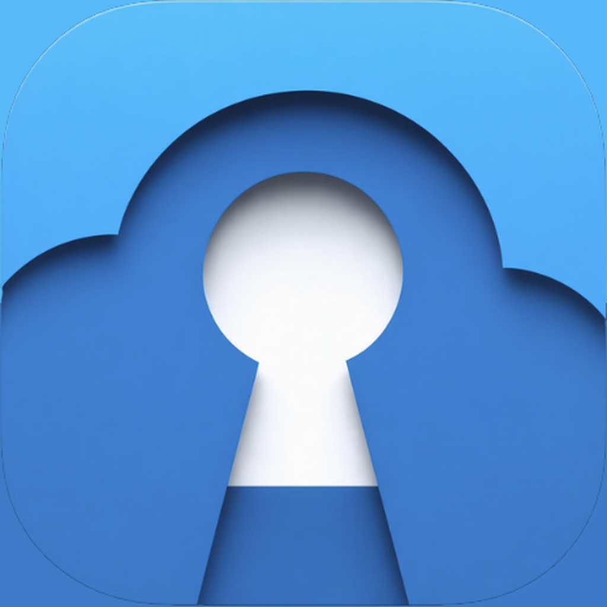

<p align="center">
  
</p>

<h1 align="center">NextPass</h1>

<p align="center">
  <a href="../../README.md">English</a> | <a href="README.de.md">Deutsch</a> | Français | <a href="README.es.md">Español</a> | <a href="README.zh-Hans.md">简体中文</a> | <a href="README.zh-Hant.md">繁體中文</a> | <a href="README.ja.md">日本語</a>
</p>

<p align="center">
  Un gestionnaire KeePass gratuit et open source pour iPhone, iPad, Mac et Apple Watch.
  <br />
  SwiftUI natif, stockage local d’abord, remplissage automatique, clés d’accès, TOTP, synchronisation Nextcloud et WebDAV, et une extension de navigateur pour Brave et Chrome.
</p>

<p align="center">
  
  
  <a href="../../LICENSE">
    
  </a>
</p>

## Pourquoi NextPass ?

NextPass est un client KeePass natif pour iPhone, iPad et Mac, conçu pour celles et ceux qui veulent garder la maîtrise de leur coffre-fort. Ouvrez des bases de données `.kdbx` depuis des fichiers locaux, Nextcloud, WebDAV ou FTP sur toutes les plateformes, et depuis iCloud Drive et d’autres fournisseurs de l’app Fichiers sur iPhone et iPad ; déverrouillez avec un mot de passe maître, un fichier clé ou la biométrie ; puis parcourez, recherchez, modifiez, enregistrez et remplissez automatiquement, sans confier votre coffre-fort à un service de mots de passe hébergé.

NextPass n’est pas encore sur l’App Store ; les versions sont distribuées aux testeurs via TestFlight.

> [!WARNING]
> **Testez avec une copie de votre base de données, pas avec votre coffre-fort principal.** Les versions de test ouvrent vos vrais fichiers `.kdbx`.

## Points forts

| Domaine | Ce que fait NextPass |
| --- | --- |
| **Compatibilité KeePass** | Lit et écrit les bases KDBX 4.x chiffrées en AES-256, ChaCha20 ou Twofish, avec AES-KDF, Argon2d ou Argon2id. Ouvre aussi les bases KDBX 3.1 en lecture seule. |
| **Modification en local d’abord** | Créez, modifiez, déplacez, fusionnez et supprimez entrées et groupes ; enregistrez avec détection des conflits, sauvegardes horodatées et conservation de l’historique des entrées et du XML inconnu. |
| **Nouvelles bases de données** | Créez de nouvelles bases KDBX 4.x en local ou sur un serveur Nextcloud, WebDAV ou FTP. |
| **Clés composites** | Déverrouillez avec un mot de passe, un fichier clé ou les deux, y compris les fichiers clés binaires, hexadécimaux, XML v1/v2 (`.key`/`.keyx`) et arbitraires. |
| **Remplissage automatique** | Remplissage automatique natif des mots de passe dans les apps et les navigateurs, avec déverrouillage biométrique ; sur iPhone et iPad, suggestions QuickType et création d’entrées depuis l’extension en plus. |
| **Clés d’accès** | Enregistrez et utilisez des clés d’accès FIDO2/WebAuthn dans votre base KeePass, dans des champs compatibles KeePassXC — ajoutées à une entrée de connexion existante ou à une nouvelle entrée dans le groupe de votre choix. |
| **Extension de navigateur** | Sur Mac, une extension pour Brave et Chrome liste les entrées du site ouvert, recherche dans toute la base et remplit la connexion. La base reste dans NextPass, et chaque navigateur doit être autorisé avec un code identique. |
| **TOTP** | Codes à usage unique avec compte à rebours et copie, configurés depuis un QR code ou un lien de configuration, plus le remplissage automatique des codes de vérification sur iOS 18+ et Mac. |
| **Apple Watch** | Les entrées étiquetées « Apple Watch » sont copiées sur la montre, dont les codes de vérification continuent de fonctionner quand l’iPhone est hors de portée. |
| **Synchronisation cloud** | Connectez-vous à Nextcloud via le navigateur, ou à n’importe quel serveur WebDAV ou FTP, avec synchronisation en lecture/écriture sur toutes les plateformes. |
| **Pièces jointes** | Consultez les pièces jointes des entrées KeePass, prévisualisez les fichiers pris en charge avec Coup d’œil et partagez-les depuis des fichiers temporaires protégés et éphémères. La modification des pièces jointes n’est pas encore prise en charge. |
| **Natif sur chaque écran** | Navigation ciblée sur iPhone, espace de travail en vue partagée sur iPad et app Mac native avec menus, commandes et Touch ID. |
| **Sécurité** | Chiffrement AES-GCM des secrets en mémoire, délai croissant après les échecs de déverrouillage, limites contre les bombes de décompression et comparaison HMAC en temps constant. |

## Confidentialité

NextPass n’intègre aucune analyse, aucune télémétrie en arrière-plan et aucun SDK de rapports de plantage. Les données du coffre-fort restent sur l’appareil et dans les emplacements de stockage que vous choisissez. L’accès réseau se limite aux serveurs que vous connectez, au téléchargement facultatif des icônes de sites via DuckDuckGo, aux achats facultatifs sur l’App Store pour les pourboires et au formulaire de commentaires de l’app lorsque vous envoyez explicitement un message. L’app Mac écoute aussi sur 127.0.0.1 pour son extension de navigateur, et seulement si vous l’activez ; rien en dehors de votre Mac ne peut l’atteindre.

Sur iPhone et iPad, les secrets copiés sont marqués comme locaux afin de ne pas transiter par le Presse-papiers universel. macOS n’offre pas cette exclusion : les secrets copiés peuvent donc suivre votre réglage du Presse-papiers universel ; NextPass les marque comme masqués et efface son entrée du presse-papiers après un court délai ou au verrouillage de la base. NextPass protège aussi les aperçus du sélecteur d’apps sur iPhone et iPad. Le blocage des captures d’écran sur Mac est fourni au mieux et peut ne pas empêcher toutes les captures ou tous les enregistrements.

## Sécurité des données

NextPass prend la sécurité des données très au sérieux : un gestionnaire de mots de passe ne doit jamais corrompre votre coffre-fort ni en perdre une partie en silence. Avant la publication de toute modification, des tests automatisés vérifient que :

- **Rien ne se perd à l’enregistrement.** Chaque type de modification est enregistré puis relu élément par élément — mots de passe, notes, pièces jointes, historique des entrées et même les données d’autres apps KeePass que NextPass ne reconnaît pas doivent revenir exactement telles qu’elles sont entrées.
- **Votre fichier est protégé avant d’être modifié.** NextPass refuse d’écraser des modifications faites ailleurs pendant que le fichier était ouvert, crée une sauvegarde horodatée avant chaque enregistrement et rejette les bases endommagées au lieu d’en charger une partie.
- **Un programme indépendant le confirme.** Chaque version doit passer une vérification où KeePassXC — une app KeePass répandue qui ne partage aucun code avec NextPass — ouvre les bases écrites par NextPass, déchiffre les mots de passe et confirme que les pièces jointes sont identiques bit à bit. Les bases créées par d’autres logiciels KeePass doivent de même s’ouvrir dans NextPass et rester lisibles ailleurs après leur enregistrement par NextPass.

Pour les plus curieux, la suite de tests est décrite dans [`KeeForgeTests/AGENTS.md`](../../KeeForgeTests/AGENTS.md) et la vérification préalable aux versions dans [`ci_scripts/README.md`](../../ci_scripts/README.md) (en anglais).

## Origines

NextPass est un fork de [KeeForge](https://github.com/KeeForge/KeeForge), l’app KeePass open source de crazytan et de ses contributeurs. Les dossiers sources, les cibles Xcode et les types Swift portent encore ce nom.

## Plan du projet

```text
KeeForge/             # Code source partagé de l’app
├── App/              # Point d’entrée, shell racine adaptatif, cycle de vie des scènes
├── Extensions/       # Utilitaires partagés de compatibilité entre plateformes
├── Models/           # Lecteur/écrivain KDBX, cryptographie, brouillon d’édition, TOTP, clés d’accès
├── Resources/        # Catalogues de chaînes et de ressources
├── Services/         # Persistance, synchronisation cloud, trousseau, signets, pièces jointes, remplissage automatique, pont navigateur
├── ViewModels/       # Liste des bases, déverrouillage, enregistrement, recherche, tri, état TOTP
├── Views/            # Écrans SwiftUI, éditeur, réglages, pourboires, contrôles réutilisables
AutoFillExtension/    # Fournisseur d’identifiants, authentification par clé d’accès, création d’identifiants
BrowserExtension/     # L’extension pour Brave et Chrome
KeeForgeMac/          # Configuration et entitlements de l’app macOS native
KeeForgeWatch/        # App Apple Watch
KeeForgeMacUITests/   # Tests XCUITest de l’app macOS
KeeForgeTests/        # Tests unitaires
KeeForgeUITests/      # Tests XCUITest
TestFixtures/         # Bases .kdbx et fichiers clés d’exemple
Vendor/               # Package Swift Twofish intégré
ci_scripts/           # Scripts d’amorçage Xcode Cloud et de vérification avant version
scripts/              # Outils de développement locaux
```

## Documentation

- [`CHANGELOG.md`](../../CHANGELOG.md) – historique des versions
- [`ROADMAP.md`](../../ROADMAP.md) – travaux prévus et priorités ouvertes
- [`AGENTS.md`](../../AGENTS.md) – contexte pour les agents de code
- [`KeeForge/README.md`](../../KeeForge/README.md) – architecture de la cible de l’app
- [`AutoFillExtension/AGENTS.md`](../../AutoFillExtension/AGENTS.md) – contraintes de l’extension et notes sur le code partagé
- [`BrowserExtension/README.md`](../../BrowserExtension/README.md) – installer et utiliser l’extension de navigateur
- [`SECURITY.md`](../../SECURITY.md) – politique de signalement des vulnérabilités
- [`docs/macos-security-notes.md`](../../docs/macos-security-notes.md) – modèle de sécurité macOS, limites de la plateforme et mesures d’atténuation
- [`docs/`](../../docs/) – spécifications, audits et documents de conception détaillés

Hormis ce README et [`CONTRIBUTING.fr.md`](CONTRIBUTING.fr.md), la documentation pour développeurs est maintenue uniquement en anglais.

## Support

- Code source et tickets : [git.kw.at/stephan/nextpass](https://git.kw.at/stephan/nextpass)

## Contribuer

Consultez [`CONTRIBUTING.fr.md`](CONTRIBUTING.fr.md) pour les prérequis de compilation, la compilation depuis les sources, le workflow des pull requests, l’exigence de signature Developer Certificate of Origin, et les conditions de licence. Commencez par [`AGENTS.md`](../../AGENTS.md), puis ouvrez la `README.md` locale du dossier le plus proche du code que vous modifiez.

## Licence

NextPass est sous licence GPLv3, comme KeeForge avant lui. Voir [`LICENSE`](../../LICENSE) pour les détails.
